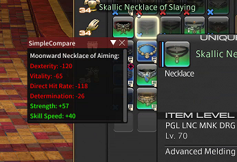

# SimpleCompare
SimpleCompare is a FFXIV Dalamud Plugin for simpler item comparison (like in this other big mmo).
Just press SHIFT while hovering over your item in the inventory and a tooltip will show the difference of this item to the currently equipped one!



## Requirements

- Final Fantasy XIV via [XIVLauncher](https://goatcorp.github.io/) with Dalamud enabled

## Installation

Release builds are published by CI to the author's custom Dalamud plugin repository
(`Rennerdo30/MyDalamudPlugins`). Add that repo's `pluginmaster.json` under
`/xlsettings` → **Experimental** → *Custom Plugin Repositories*, then install **SimpleCompare** from
the plugin installer.

Alternatively, build it yourself (below) and drop the output folder into your `devPlugins` directory.

## Building

Dalamud's dev assemblies are referenced from `%AppData%\XIVLauncher\addon\Hooks\dev\`, so run the game
through XIVLauncher at least once first (or unpack
[dalamud-distrib](https://goatcorp.github.io/dalamud-distrib/latest.zip) there yourself).

```
dotnet restore -r win SimpleCompare.sln
dotnet build --configuration Release
```

Output lands in `SimpleCompare/bin/x64/Release/SimpleCompare`.

## Built with

C# / .NET 7 (x64), Dalamud, ImGui.NET, FFXIVClientStructs and Lumina.

## Credits

By 53m1k0l0n and rennerdo30.

## License

MIT — see [LICENSE](LICENSE).
